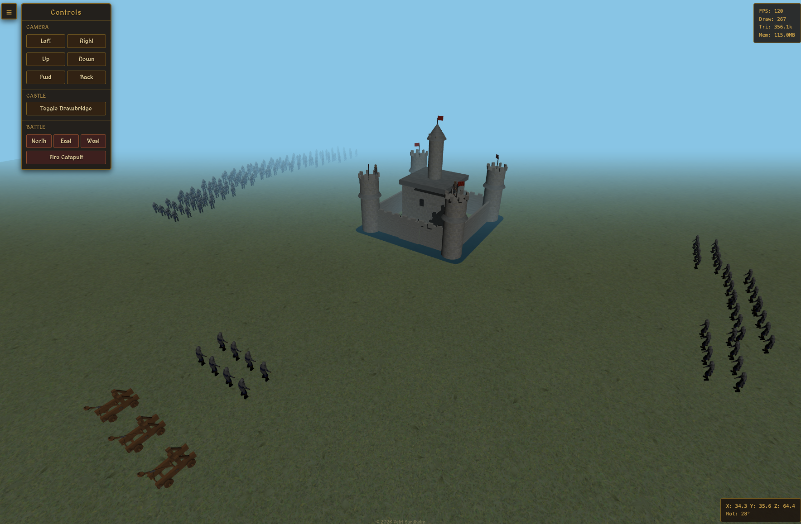

# Castle3D - Interactive 3D Castle Demo



A game-style 3D castle built with Three.js, featuring interactive controls, animated gate mechanics, and a defensive moat system. The castle showcases a central keep with perimeter walls, corner towers, and a water moat with rounded corners surrounding the defensive structure.

## Features

### Castle Architecture
- **Central Keep**: A 10x10x10 stone keep with textured brick walls and a flat roof
- **Perimeter Walls**: Four defensive walls (20x5) with crenellated battlements
- **Corner Towers**: Four cylindrical towers at each corner with conical roofs
- **Gate System**: Dual-hinged gate that opens and closes with smooth animation
- **Windows**: Dark glass windows on the keep with metal frame decorations

### Defensive Features
- **Water Moat**: A rectangular moat with rounded corners surrounding the castle walls, providing a defensive barrier
- **Gate Rings**: Decorative metal rings on the gate for authentic medieval aesthetics

### Interactive Controls
- **Camera Controls**: OrbitControls for smooth camera rotation and zoom (mouse/trackpad)
- **Movement Controls**: Six directional buttons to move the entire castle:
  - Left/Right (X-axis)
  - Up/Down (Y-axis)
  - Forward/Backward (Z-axis)
- **Gate Toggle**: Button to open and close the castle gate

### Visual Features
- **Textured Materials**: 
  - Stone brick texture for walls and keep
  - Roof tile texture for tower and keep roofs
  - Grass texture for ground
  - Metal materials for decorative elements
- **Lighting**: Ambient and directional lighting with shadow mapping
- **Optimized Rendering**: Anti-aliasing enabled for smooth visuals

## Installation

```bash
npm install
```

## Running

```bash
npm start
```

The application will start on `http://localhost:5173`

## Technology Stack

- **Three.js** (v0.174.0) - 3D graphics library
- **Vite** (v6.2.2) - Build tool and dev server
- **OrbitControls** - Camera control system

## Project Structure

```
castle/
├── src/
│   ├── main.js      # Main 3D scene, castle construction, and rendering
│   └── controls.js  # Movement and interaction controls
├── textures/        # Texture files (bricks, roof, grass)
├── index.html       # HTML entry point
└── package.json     # Dependencies and scripts
```

## Controls

- **Mouse/Trackpad**: Rotate and zoom the camera
- **On-screen Buttons**: Move the castle in 6 directions
- **Toggle Gate Button**: Open/close the castle gate

## Technical Details

The castle is built as a THREE.Group containing all meshes, allowing for unified movement and transformations. The gate system uses pivot groups for proper hinge-based rotation. Shadow mapping is configured to avoid artifacts on the ground plane while maintaining realistic lighting on other structures.

