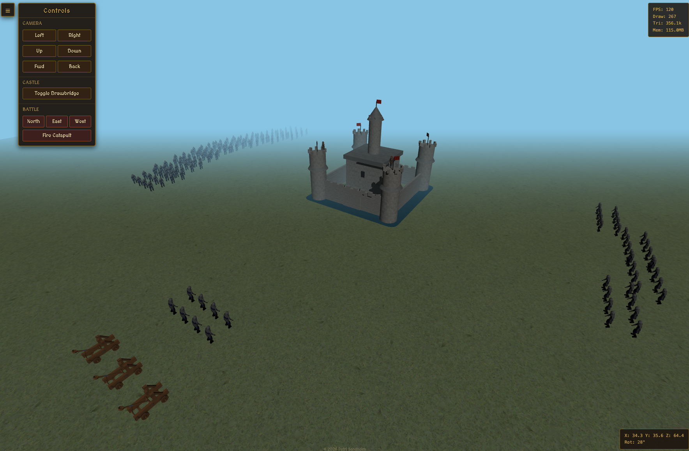

# Castle Siege - 3D Medieval Battle Simulator



An interactive 3D medieval battle simulator built with Three.js. Three armies of knights march toward a fortified castle from different directions while catapults launch boulders in parabolic arcs. Defend the keep with tower archers, raise the drawbridge, and command your forces through a medieval-themed control panel.

## Live Features

- **Fortified Castle** - Central keep with center tower, four corner towers with battlements and flags, perimeter walls with crenellations, animated drawbridge with chains, and a water moat with rounded corners
- **Knight Armies** - Three groups (North, East, West) with animated walk cycles, marching in formation toward the castle walls. East and West forces attack in curved arc formations
- **Catapult Siege** - Three catapults positioned behind the northern army. Click to fire individual catapults or launch a volley. Boulders fly in parabolic arcs with random scatter, spinning as they fall
- **Tower Defenders** - Archer models stationed on the two front towers, facing the incoming attack
- **Battle Sounds** - Marching loop plays while armies advance, bomb sound on each catapult launch
- **Splash Screen** - Blur overlay entry screen with battle description and controls guide
- **Performance Monitor** - Real-time FPS, draw calls, triangle count, and memory usage (top-right). Camera coordinates displayed bottom-right. Toggle with P key

## Controls

- **Mouse/Touch** - Orbit and zoom the camera
- **North / East / West** - March or halt knight groups (toggle)
- **Fire Catapult** - Launch volley from all three catapults
- **Click Catapult** - Fire a single catapult with random target
- **Toggle Drawbridge** - Raise or lower the drawbridge with chain animation
- **Camera Buttons** - Nudge camera position (Left, Right, Up, Down, Fwd, Back)
- **P Key** - Toggle performance stats overlay

## Knight Formations

| Group | Size | Formation | Direction |
|-------|------|-----------|-----------|
| **North** | 8 | 2 rows of 4 | Straight at the drawbridge |
| **East** | 32 | 4 groups of 8, arc curve | East wall |
| **West** | 128 | 8 groups of 16, arc curve (4 rows deep) | West wall |

## Tech Stack

- **Three.js** v0.174.0 - 3D rendering engine
- **Vite** v6.2.2 - Dev server and bundler
- **FBXLoader** - Knight character models with skeletal animation
- **GLTFLoader** - Archer and catapult models

## Project Structure

```
castle/
├── src/
│   ├── main.js          # Scene, castle geometry, characters, animation loop
│   ├── controls.js      # Button event handlers and camera movement
│   ├── paths.json       # Knight and catapult motion path data
│   └── sounds/          # March loop and catapult launch audio
├── textures/
│   ├── knights/         # Knight FBX/GLB models (walk, run, attack)
│   ├── archer/          # Archer GLB model
│   ├── catapult/        # Catapult GLB model
│   ├── bricks.jpg       # Stone wall texture
│   ├── roof.jpg         # Roof tile texture
│   └── grass.jpg        # Ground texture
├── index.html           # Entry point, splash screen, controls UI
├── vite.config.js       # Dev server config (port 5181)
└── package.json
```

## Getting Started

```bash
npm install
npm run dev
```

Opens at `http://localhost:5181`

## How It Works

### Castle Construction
The castle is built as a `THREE.Group` containing all meshes - walls, towers, keep, battlements, flags, drawbridge, and chains. The drawbridge uses a pivot group for hinge-based rotation with chain meshes that dynamically stretch between wall anchors and the bridge.

### Character System
Each character (knight, archer, catapult) is created with a motion path defined in `paths.json`. Knights load from FBX files with walk animations, wrapped in `THREE.Group` containers for proper origin centering. The animation mixer updates each frame, and position tracks are filtered to prevent root motion snap-back on loop.

### Motion Paths
Paths are defined as start positions with waypoints. Knights use segment-based routing with smooth turn interpolation. Characters face their movement direction automatically. Arc formations are generated programmatically - outer groups start further from the castle, creating a curved battle line.

### Catapult Physics
Boulders follow a parametric parabolic arc: X and Z are linearly interpolated from start to target, Y follows `arcHeight * 4t(1-t)` for the parabola. Boulders spin on two axes during flight and are removed on impact.

## License

See [MIT](LICENSE)

---